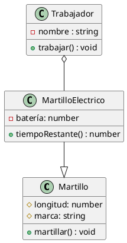

## 1. Definición de clases en Java

En Java, como en cualquier otro lenguaje de programación, podemos trasladar cualquier diagrama UML de clases a programación. Veamos unos ejemplos:



```java
class Martillo{
    protected float longitud;
    protected String marca;
    public void martillar(){
        //hace lo que hacen los martillos
    }
}
class MartilloElectrico extends Martillo{
    private float bateria;
    public int tiempoRestante(){
        int tiempo;
        //hace un cálculo y devuelve el tiempo restante
        return tiempo;
    }
}
class Trabajador{
    private String nombre;
    private MartilloElectrico martilloElectrico;
    public void Trabajar(){

    }
}
```

Como vemos, las relaciones de herencia se expresan de manera explícita a través de la palabra reservada `extends`, mientras que las relaciones de componente se representan como atributos dentro de las clases donde son contenidos los componentes.

A la hora de programar en Java, cada archivo se corresponde con una clase pública con el mismo nombre. Por convención, las clases se escriben con la primera letra en mayúscula y usando CamelCase (cada nueva palabra empieza en mayúscula), mientras que las variables se escriben con la primera letra en minúscula, pero usando CamelCase también.

Además de la clase pública, cada archivo puede tener una o más clases, aunque no es práctica común.

En Java, si no se especifica ningún tipo de visibilidad, la visibilidad por defecto es de Paquete, que es pública para los miembros del mismo paquete y privada para todos los demás. Se trata de un tipo de visibilidad muy práctica que trabajaremos más adelante.

### Actividad 5: Clases a partir de diagramas

Crea un proyecto nuevo en IntelliJ. Añade un archivo, Libro.java, y crea en él la clase Libro, cuyo diagrama creaste en la actividad 1.

Después, crea un diagrama en uml para representar una estantería de libros. Crea el archivo Estanteria.java (no uses tildes) y codifica la clase.

Haz un programa `main` de la siguiente forma:

```java
public class Main{
    public static void main(String [] args){
        Libro libro = new Libro();
        Estanteria estanteria = new Estanteria();
    }
}
```

## 1. Métodos y atributos estáticos

Existe una palabra reservada que hemos estado utilizando hasta ahora sin saber muy bien qué era: `static`. Los métodos y atributos estáticos son aquellos que no pertenecen al objeto, sino a la clase.

Esto quiere decir que una vez que el programa es ejecutado, son siempre accesibles independientemente de si hay o no instancias de la clase que los contiene.

En las primeras etapas del curso hemos usado los elementos estáticos para simular el paradigma de programación procedural en Java, es decir, la resolución de problemas mediante funciones/procedimientos y no mediante objetos.

Si declaramos una atributo como estático, se convierte en una especie de variable con ámbito dentro de toda la clase y a la cual podemos acceder desde fuera dependiendo de su visibilidad. Lo mismo sucede con los métodos.

Una cosa que hay que tener en cuenta es que no se pueden usar atributos de la clase dentro de métodos estáticos (porque, en realidad, no tiene sentido ya que no hay instancia de la clase), pero sí podemos usar atributos estáticos dentro de métodos del objeto.

En cierto modo, podemos usar las clases como contenedores de métodos estáticos, que se comportan como librerías de funciones. Tal es el caso de la clase `Math`, que incluye métodos estáticos para operaciones matemáticas complejas.

De esta manera, podemos emplear los atributos y métodos estáticos como herramientas útiles para emplear dentro o fuera de la clase.

### Actividad 8: Uso de métodos y atributos estáticos

Crea una variable estática dentro de la clase libro que sirva para contar el número de libros (instancias) que hay. Empléala para darles a cada libro un identificador único. Para ello, añade un atributo privado `id` de tipo entero. El `id` no debe pasarse como atributo al constructor ni debe poder ser modificado con un setter.

Después, crea un método estático dentro de la clase Estantería que reciba como parámetro una estantería y devuelva un array de string. El contenido del array de string es cada uno de los parámetros, incluido el `id`, separado por el caracter `;`. Puedes rodear cada parámetro entre \` \` si dentro de alguno de los campos hubiera un `;`. Cada libro ocupa un espacio distinto del array. A este formato de texto se le conoce como CSV (Comma Separated Values) y es muy empleado en la codificación de datos.