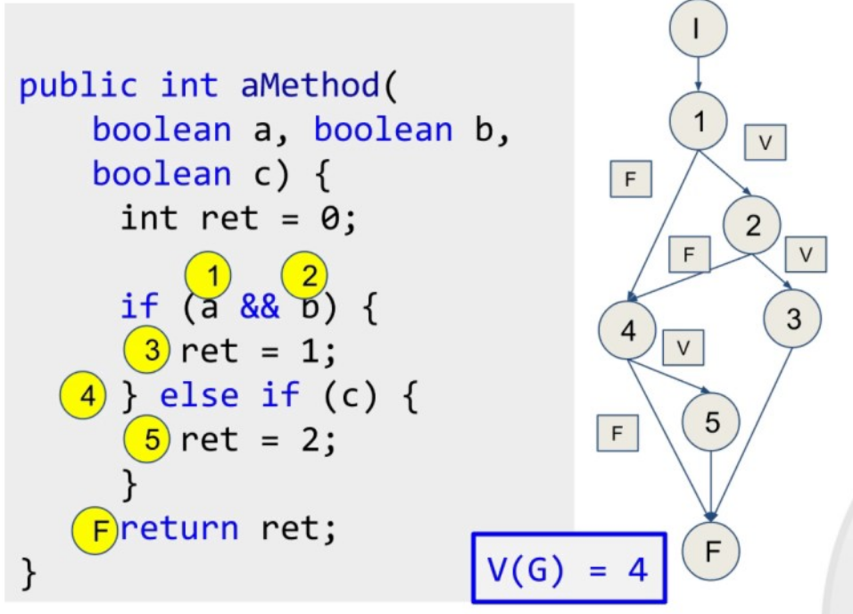
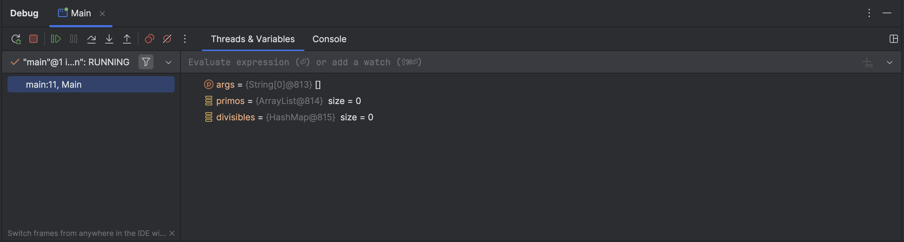

<style> body{
    text-align: justify;
    }
    p{
        text-indent: 2rem;
    } 
</style>

# Depuración

En este documento vamos a analizar diversas técnicas para comprobar el comportamiento de nuestro programas, relacionadas con las pruebas de tipo caja blanca. Primero veremos los tipos de pruebas de caja blanca, después el uso de trazas y tablas de verdad para finalmente introducirnos en el uso del depurador, concretamente del integrado en el IDE IntelliJ Community Edition.

## Pruebas de caja blanca

### Pruebas de camino básico

Las pruebas de camino básico tienen como fin determinar el camino que puede seguir la ejecución de un código. Para ello, se organiza cada operación atómica (de un solo paso) del código en un diagrama de árbol, como se ve en la siguiente imagen:



Se llama complejidad ciclomática, representada con V(G), al número de caminos distintos que puede tomar el programa. Los caminos sirven para poder diseñar pruebas de unidad que verifiquen el funcionamiento de cada uno de ellos.

>**Actividad:** Diseña pruebas de camino básico para el siguiente algoritmo:
```java
if (num1 > 10)
{
    if (num2 > 10)
        System.out.println("Ambos son mayores");
    else
        System.out.println("El primero es mayor");
} else {
    if (num2 > 10)
        System.out.println("El segundo es mayor");
    else
        System.out.println("Ninguno es mayor");
}
```

### Pruebas condicionales

Las pruebas condicionales analizan el camino que puede seguir la ejecución de un código centrándose en las condiciones del mismo. Para evaluar dichos caminos, la herramienta que se emplea son las **tablas de verdad**.

Una tabla de verdad es una herramienta utilizada en lógica proposicional para representar todos los posibles valores de verdad de una expresión lógica, en función de los valores de verdad de sus variables. Podemos etiquetar las condiciones que vayamos encontrando y realizar una tabla que nos señale los caminos posibles. Asimismo, también podemos anotar las veces que se repite un bucle en función de los valores de entrada.
```java
public boolean esAnyoBisiesto(int anyo)
{
    boolean esAnyoBisiesto = false;
    if(anyo % 4 == 0)
    {
        esAnyoBisiesto = true;

        if(anyo % 100 == 0)
        {
            esAnyoBisiesto = false;

            if(anyo % 400 == 0)
            {
                esAnyoBisiesto=true;
            }
        }
    }
    return esAnyoBisiesto;
}
```

A partir del código anterior, etiquetamos las condiciones para crear una tabla de verdad:

* C1 = anyo % 4 == 0;
* C2 = anyo % 100 == 0;
* C3 = anyo % 400 == 0;

Y creamos la siguiente tabla:

|N	|C1	|C2	|C3	|esAnyoBisiesto|
|--|--|--|--|--|
|1	|true	|true	|true	|true|
|2	|true	|true	|false	|false|
|3	|true	|false	|true	|true|
|4	|true	|false	|false	|true|
|5	|false	|true	|true	|false|
|6	|false	|true	|false	|false|
|7	|false	|false	|true	|false|
|8	|false	|false	|false	|false|

Si nos fijamos bien, los casos 3 y 4 llevan al mismo resultado independientemente de C3 y algo similar ocurre con los casos del 5 al 8, que dependen de C1, por lo que podemos simplificar la tabla de la siguiente forma:

|N	|C1	|C2	|C3	|esAnyoBisiesto
|--|--|--|--|--
|1	|true	|true	|true	|true
|2	|true	|true	|false	|false
|3	|true	|false	|*	|true
|4	|false	|*	|*	|false

>**Actividad:** Utiliza el código del ejercicio del apartado anterior para realizar las pruebas condicionales.

### Pruebas de comprobación de bucles

Esta prueba evalúa los posibles caminos para los bucles. Para cada bucle con *n* iteraciones, debemos verificar si:  

- El bucle nunca se ejecuta.  
- El bucle se ejecuta solo una vez.  
- El bucle se ejecuta dos veces.  
- El bucle se ejecuta *m* veces, siendo *m < n*.  
- El bucle se ejecuta *n* y *n-1* veces.  

Si hay algún bucle anidado, debemos comenzar explorando los bucles internos y luego pasar a los externos.  

Por ejemplo, observemos el siguiente código que verifica si un número dado (introducido previamente por el usuario) es primo o no:  

```java
boolean result = true;
if (number == 0 || number == 1)
    result = false;
int i = 2;
while (i <= number / 2 && result)
{
    if (number % i == 0)
        result = false;
    else
        i++;
}
```

Se espera que el bucle se ejecute como máximo hasta `N = number / 2 - 1` veces. Según el enfoque de prueba de bucles, debemos diseñar casos de prueba en los que:  

- **El bucle nunca se ejecuta.** Por ejemplo, si el número es 2, automáticamente es primo y no se realiza ninguna iteración.  
  También podríamos probar los casos de 0 y 1, que están cubiertos por la primera cláusula *if*.  

- **El bucle se ejecuta una vez.** Esto se puede lograr con *number = 3*.  

- **El bucle se ejecuta dos veces.** Por ejemplo, con *number = 9*.  

- **El bucle se ejecuta *m* veces, donde *m < N*.** Por ejemplo, con *number = 25*, el bucle se ejecuta 4 veces.  

- **El bucle se ejecuta *N* veces y/o *N-1* veces.** Para alcanzar *N* iteraciones, solo necesitamos un número primo, como *23*.  
  Para iterar *N-1* veces, necesitamos un número compuesto que no se descubra hasta la última iteración.  
  En este caso, podríamos usar *number = 4*, aunque es un caso de prueba bastante simple.  

Podemos construir la siguiente tabla de casos de prueba:  

| ID  | Nombre          | Datos  | Resultado esperado | Resultado real |
|-----|---------------|--------|------------------|---------------|
| U0  | BasicCases    | 1      | false            |               |
| U1  | NoIterations  | 2      | true             |               |
| U2  | OneIteration  | 3      | true             |               |
| U3  | TwoIterations | 9      | false            |               |
| U4  | MIterations   | 25     | false            |               |
| U5  | N-1Iterations | 4      | false            |               |
| U6  | NIterations   | 23     | true             |               |

 

>**Actividad:** El siguiente fragmento de código verifica si los dígitos de un número están en orden ascendente:  
>

```java
boolean result = true;
while (number >= 10 && result)
{
    int lastDigit = number % 10;
    number /= 10;
    int newLastDigit = number % 10;
    if (lastDigit < newLastDigit)
        result = false;
}
```

> Se te pide diseñar una tabla de casos de prueba considerando todas las posibles iteraciones del bucle, siguiendo el ejemplo anterior.

***Información extraída de [esta página web](https://nachoiborraies.github.io/entornos/md/en/06b).***


## Depuración de Software: El Debugger

>**Actividad:** Para comprender el funcionamiento del Debugger de IntelliJ, realiza una memoria por escrito de las actividades de este apartado. Usa capturas de pantalla para copiar los resultados obtenidos.

Podemos hacer trazas en programas añadiendo salidas por consola de variables o datos. Esto puede ser efectivo para hacernos una idea de lo que está sucediendo en el código, pero no es muy práctico para hacer un análisis pormenorizado del comportamiento de nuestro programa. En muchos programas es más adecuado usar un **debugger**, que generalmente está integrado en cualquier IDE.

Un **debugger** es una herramienta para inspeccionar y analizar el comportamiento de un programa mientras se ejecuta. De esta forma, nos permite identificar y corregir errores en el código (bugs).

Para controlar el flujo de un programa, indicamos puntos de ruptura (breakpoints), en los cuales se detiene el programa. También podemos realizar ejecuciones paso a paso.

En todo momento, podemos controlar el estado del programa gracias a esta herramienta de depuración.

## Uso del debugger de IntelliJ

Vamos a comprobar el funcionamiento del Debugger con este código en IntelliJ. Crea un proyecto y copia este código:

```java{.line-numbers}
import java.util.ArrayList;
import java.util.HashMap;
import java.util.List;
import java.util.Map;

public class Main {
    public static void main(String[] args) {
        List<Integer> primos = new ArrayList<>();
        Map<Integer, Integer> divisibles = new HashMap<>();

        for(int i = 0; i< 50; i++){
            boolean esPrimo = true;
            int divisores = 0;
            for(int j = 2; j<i; j++){
                if(i % j == 0){
                    esPrimo = false;
                    divisores++;
                }
            }
            if (esPrimo){
                primos.add(i);
            }else{
                divisibles.put(i, divisores);
            }
        }
        for(Integer i : primos){
            System.out.println("El número " + i + " es primo");
        }
        for(Integer i : divisibles.keySet()){
            int divisores = divisibles.get(i);
            String msg = "El número " + i + " no es primo y tiene " + divisores;
            msg += (divisores>1)? " divisores.":" divisor.";
            System.out.println(msg);
        }
    }
}
```

Lo primero que debemos hacer es añadir un punto de ruptura. Para ello hacemos click en la línea 11. Se añade un punto rojo, que es el punto de ruptura. Al hacer click en la ejecución de Debug, al llegar a ese punto el programa se detendrá y nos permitirá inspeccionar las variables.

Los puntos de ruptura pueden ser condicionales o incondicionales. Para añadir una condición a un punto de ruptura, haz click derecho. En la línea 20, añade la condición `esPrimo` para que el programa solo se detenga cuando la variable `esPrimo` sea cierta.

>**Actividad**: Comprueba el funcionamiento de los dos puntos de ruptura. Añade un punto más, siendo uno incondicional y el otro condicional. Después bórralos haciendo click.

Cuando activas la depuración, la información se muestra en la pantalla inferior (donde está normalmente la consola):



En este menú podemos ver los puntos de ruptura, realizar acciones de ejecución paso a paso (que veremos más adelante) y comprobar el valor de las variables.

>**Actividad**: Inspecciona el valor de las variables en el punto de ruptura de la línea 11 cuando `i` vale `12`. ¿Qué información tenemos que no aparece en nuestro código?


Una vez establecido un punto de ruptura, al parar podemos continuar la ejecución del programa paso a paso de las siguientes formas:

- **Step Over**: Ejecuta la línea actual y pasa a la siguiente, sin entrar en los detalles de las funciones llamadas.
- **Step Into**: Entra en el código de las funciones llamadas para inspeccionarlas.
- **Step Out**: Sale de la función actual y regresa al punto donde fue llamada.

Además, contamos con la **Pila de Llamadas** (Call Stack):
- Muestra la secuencia de llamadas a funciones que llevaron al punto actual de ejecución.
- Te ayuda a entender cómo llegaste a un punto específico en el código.

Todas estas opciones están en el menú del debugger. Para comprobar cómo funcionan, vamos a modificar el código de la siguiente forma, añadiendo funciones:

```java {.line-numbers}
import java.util.ArrayList;
import java.util.HashMap;
import java.util.List;
import java.util.Map;

public class Main {
    public static void main(String[] args) {
        List<Integer> primos = new ArrayList<>();
        Map<Integer, Integer> divisibles = new HashMap<>();

        for(int i = 0; i< 50; i++){
            boolean esPrimo = true;
            int divisores = 0;
            for(int j = 2; j<i; j++){
                if(i % j == 0){
                    esPrimo = false;
                    divisores++;
                }
            }
            if (esPrimo){
                primos.add(i);
            }else{
                divisibles.put(i, divisores);
            }
        }
        visualizar(primos);
        visualizar(divisibles);
    }
    private static void visualizar(List<Integer> primos){
        for(Integer i : primos){
            System.out.println("El número " + i + " es primo");
        }
    }
    private static void visualizar (Map<Integer, Integer> divisibles){
        for(Integer i : divisibles.keySet()){
            int divisores = divisibles.get(i);
            String msg = "El número " + i + " no es primo y tiene " + divisores;
            msg += (divisores>1)? " divisores.":" divisor.";
            System.out.println(msg);
        }
    }
}
```
Añade un punto de ruptura en la línea 26 y otro en la línea 38.

>**Actividad:** Prueba las funciones de Step Over, Step Into (desde la línea 26) y Step Out (desde la línea 38). Observa la pila de llamadas y también los valores.
>
> - Prueba primero el *Step Over* desde la línea 26, avanzando 3 pasos. Después, vuelve a ejecutar el debug y prueba el *Step Into* también con tres pasos. ¿Qué diferencia hay?
>
> - Después prueba el *Step Out* desde la línea 38. Describe qué sucede.


