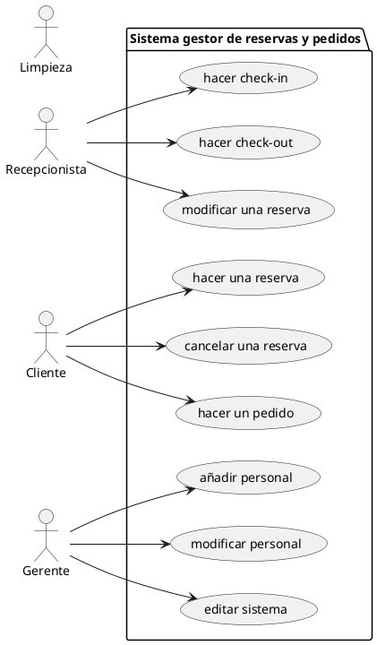

**Diseña las siguientes pruebas para una aplicación determinada:**

- **(2 puntos)** Pruebas unitarias: diseña escenarios en los que usarías pruebas tipo JUnit (caja negra, basadas en casos de uso). Es necesario representarlas en forma de tabla:

|ID|Nombre de prueba|método|descripción (precondiciones y pasos)|entrada|salida esperada|salida obtenida|
|--|---------------|--|--|--|--|--|
|1  
|2
|3
|...
- **(1 punto)** Pruebas de integración: diseña escenarios en los que usarías pruebas tipo Mockito y GitHub Actions (simulación de componentes y tareas automatizadas en cada cambio).  
- **(1 punto)** Pruebas de aceptación: diseña escenarios usando pruebas tipo Cucumber, utilizando lenguaje Gherkin para definir los criterios del cliente.  
- **(1 punto)** Pruebas de seguridad: diseña escenarios donde se ponga a prueba la robustez y protección del sistema ante fallos o ataques.  
- **(1 punto)** Justifica cada una de las pruebas indicadas anteriormente.

### APLICACIÓN:

Estamos desarrollando una **plataforma de gestión de reservas y pedidos para un hotel**. Los roles principales son: *Recepcionista, Cliente, Gerente, y Limpieza*.  
Cada usuario accede desde su propio terminal (dispositivo móvil o PC) utilizando credenciales personalizadas.  
La aplicación se conecta con un sistema de reservas externo vía API REST y también accede a una base de datos SQL.  
Las funcionalidades están representadas en el siguiente diagrama de casos de uso:

