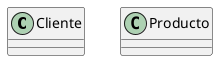
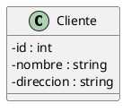

# Técnicas de modelado

## Técnicas de Modelado con Diagramas de Clases UML

Modelar un sistema con diagramas de clases UML no es solo dibujar cajas y flechas; es un proceso iterativo y reflexivo para entender y comunicar la estructura de un software. Implica identificar las entidades, sus características y cómo interactúan. Aquí te presento algunas técnicas clave para un modelado efectivo:


### 1. Identificación de Clases Candidatas

El primer paso es reconocer las posibles clases en tu sistema. Esto se puede hacer de varias maneras:

* **Análisis de Sustantivos:** Lee la descripción del problema o los requisitos del sistema y subraya todos los **sustantivos** (personas, lugares, cosas, conceptos, eventos). Cada sustantivo es un candidato potencial para una clase.
    * **Ejemplo:** En un "sistema de gestión de biblioteca", sustantivos como "libro", "miembro", "préstamo", "autor", "editorial" son posibles clases.
* **Análisis de Tarjetas CRC (Class, Responsibility, Collaboration):** Una técnica sencilla y colaborativa. Cada tarjeta representa una clase.
    * **Clase (C):** Nombre de la clase.
    * **Responsabilidad (R):** Qué sabe la clase y qué hace (sus atributos y métodos).
    * **Colaboración (C):** Con qué otras clases interactúa para cumplir sus responsabilidades.
    * Es útil para un brainstorming rápido y para asegurar que cada clase tiene una **responsabilidad única** (relacionado con el Principio de Responsabilidad Única de SOLID).
* **Identificación de Roles:** Las personas o sistemas externos que interactúan con tu sistema pueden ser clases (ej., `Administrador`, `Cliente`).
* **Identificación de Eventos y Transacciones:** Acciones significativas que ocurren en el sistema (ej., `Venta`, `Devolucion`, `Registro`).


### 2. Definición de Atributos y Comportamientos (Métodos)

Una vez que tienes tus clases candidatas, el siguiente paso es dotarlas de contenido:

* **Atributos:** Piensa en las **propiedades** que necesita conocer cada instancia de la clase para ser completamente descrita.
    * ¿Qué datos necesita almacenar este objeto?
    * ¿Qué características lo distinguen?
    * **Reflexión sobre el tipo de dato y visibilidad:** Decide el tipo de dato apropiado (string, int, Date, etc.) y la visibilidad (`+` público, `-` privado, `#` protegido). La mayoría de los atributos deberían ser **privados** para asegurar la **encapsulación**.
* **Métodos:** Identifica las **acciones** que la clase puede realizar o que se pueden realizar sobre ella.
    * ¿Qué puede hacer este objeto?
    * ¿Qué operaciones se necesitan para manipular sus atributos o interactuar con otras clases?
    * **Reflexión sobre el comportamiento y visibilidad:** Decide los parámetros que necesita el método, el tipo de retorno y su visibilidad. Los métodos que forman la API pública de la clase suelen ser **públicos**.


### 3. Modelado de Relaciones entre Clases

Las clases no existen en el vacío; interactúan. Modelar estas interacciones es crucial:

* **Asociaciones:** La relación más genérica entre dos clases. Indica que los objetos de una clase están conectados o utilizan objetos de otra.
    * **Identificación:** Busca verbos que conecten sustantivos (ej., "un cliente *realiza* un pedido").
    * **Cardinalidad:** Es fundamental especificar cuántas instancias de una clase están relacionadas con cuántas instancias de otra (1 a 1, 1 a muchos, muchos a muchos).
    * **Navegabilidad:** Indica la dirección en la que se puede acceder desde un objeto a otro. Por defecto, es bidireccional, pero a menudo es unidireccional en la implementación.
* **Agregación (o--):** Representa una relación "todo-parte" donde las partes pueden existir independientemente del todo.
    * **Identificación:** "Un coche *tiene* ruedas" (las ruedas existen aunque el coche se desguace).
* **Composición (*--):** Una forma fuerte de agregación donde las partes no pueden existir sin el todo. Si el todo es destruido, las partes también lo son.
    * **Identificación:** "Una casa *tiene* habitaciones" (las habitaciones no existen si la casa se derrumba).
* **Dependencia (..>):** La relación más débil. Una clase "usa" otra, generalmente porque un método de una clase recibe un objeto de la otra como parámetro, o lo crea localmente. No implica que un objeto sea parte de otro.
    * **Identificación:** "Un cliente *envía* un email" (la clase `Cliente` usa la clase `EmailSender` para su método `enviarEmail`).


### 4. Refinamiento y Verificación

El modelado es un proceso iterativo. Rara vez acertarás a la primera.

* **Aplicación de Principios de Diseño (SOLID):**
    * **SRP (Responsabilidad Única):** ¿Cada clase tiene una única razón para cambiar? Si una clase tiene demasiados atributos o métodos no relacionados, considera dividirla.
    * **OCP (Abierto/Cerrado):** ¿Pueden mis clases extenderse sin modificación? Las interfaces y clases abstractas son clave aquí.
    * **LSP (Sustitución de Liskov):** (Aunque aún no hemos visto herencia, es bueno tenerlo en mente para el futuro).
    * **ISP (Segregación de Interfaces):** ¿Tus interfaces son lo suficientemente pequeñas y específicas para evitar forzar a los clientes a implementar métodos que no necesitan?
    * **DIP (Inversión de Dependencias):** ¿Las clases de alto nivel dependen de abstracciones en lugar de detalles concretos?
* **Revisión con Escenarios de Uso (Casos de Uso):** Recorre los casos de uso principales del sistema y simula cómo los objetos interactuarían en tu diagrama de clases.
    * ¿Se pueden realizar todas las acciones?
    * ¿Hay clases que tienen demasiadas responsabilidades?
    * ¿Faltan atributos o métodos?
    * ¿Las relaciones son lógicas y tienen la cardinalidad correcta?
* **Coherencia y Claridad:** Asegúrate de que el diagrama sea fácil de entender. Usa nombres claros para clases, atributos y métodos. Evita complejidades innecesarias.
* **Iteración:** El modelado es un ciclo: identifica, define, relaciona, revisa y repite.

> **Actividad** 
> Modela un diagrama de clases a partir del siguiente enunciado.
>
> *Sistema de Gestión de Alquiler de Coches*
> 
> Se te ha encargado desarrollar un sistema de gestión para una empresa de alquiler de coches. La empresa tiene un nombre y varias sucursales distribuidas en distintas ciudades. Cada sucursal está identificada por su ciudad y dirección.
>
>Cada sucursal cuenta con una flota de vehículos de diferentes tipos (por ejemplo, sedán, SUV, furgoneta). Cada vehículo está identificado por una matrícula, modelo, marca, año de fabricación, y el número de asientos. Además, cada coche puede estar disponible o alquilado.
>
>El sistema debe permitir:
>
>- Registrar la información de nuevos vehículos en una sucursal.
>- Alquilar un coche a un cliente. Para ello, se debe registrar el nombre del cliente, su identificación y el coche que ha alquilado.
>- Devolver coches alquilados.
>- Consultar la disponibilidad de vehículos en cada sucursal.
>- Filtrar los vehículos por tipo, marca o número de asientos.
>
>Además, el sistema debe llevar un control de la cantidad de vehículos disponibles y en uso por cada sucursal, y debe permitir acceder a la información de cada coche, sucursal y cliente.


## De Diagrama Entidad-Relación a Diagrama de Clases UML: Una Aproximación

La conversión de un **Diagrama Entidad-Relación (ER)** a un **Diagrama de Clases UML** es un paso común en el diseño de software, especialmente cuando se parte de un modelo de datos conceptual o lógico para desarrollar una aplicación orientada a objetos. Aunque no es una traducción 1:1 perfecta (ya que los Diagramas ER se centran en los datos y las bases de datos, mientras que los diagramas de clases modelan el comportamiento y la estructura del código), hay una serie de reglas de aproximación muy útiles.

El objetivo es transformar las entidades y relaciones del Diagrama ER en clases, atributos y asociaciones en el diagrama de clases, preparándonos para la implementación en un lenguaje orientado a objetos.

### Reglas de Conversión Aproximadas

A continuación, se describen las correspondencias más habituales:

#### 1\. Entidades -> Clases

  * **Cada entidad fuerte (o entidad normal) en el Diagramas ER se convierte en una clase en el diagrama de clases UML.**

  * El **nombre de la entidad** se convierte en el nombre de la clase. Se recomienda usar **UpperCamelCase** (PascalCase) para los nombres de las clases.

    **Ejemplo:**

      * Entidad: `CLIENTE` $\\rightarrow$ Clase: `Cliente`
      * Entidad: `PRODUCTO` $\\rightarrow$ Clase: `Producto`




#### 2\. Atributos de Entidades -> Atributos de Clases

  * **Cada atributo de una entidad se convierte en un atributo de la clase correspondiente.**

  * El **nombre del atributo** se mantiene, pero se recomienda usar **lowerCamelCase**.

  * El **tipo de dato** del atributo (ej., `VARCHAR(50)`, `INT`, `DATE`) se traduce al tipo de dato más apropiado en el lenguaje de programación objetivo (ej., `string`, `int`/`number`, `Date`).

  * Los **atributos clave primaria (PK)** se suelen representar como atributos normales en la clase, a menudo con un estereotipo `<<PK>>` o simplemente identificados por contexto. Su unicidad y la imposibilidad de ser nulos se gestionarán a nivel de implementación (constructores, lógica de negocio).

  * Los **atributos clave foránea (FK)** que solo sirven para establecer una relación (es decir, no son datos intrínsecos de la entidad) **no se representan directamente como atributos** en la clase receptora en UML. En su lugar, la relación se modela como una **asociación** entre las clases. Si la FK representa un valor que es significativo para el objeto más allá de la relación (ej., `idPaisNacimiento` en una persona, cuando el `Pais` es otra clase), entonces sí podría mantenerse como atributo.

    **Ejemplo:**

      * Entidad `CLIENTE` con atributos `id_cliente` (PK), `nombre`, `direccion`
      * Clase `Cliente` con atributos `- id : int`, `- nombre : string`, `- direccion : string`




#### 3\. Relaciones -> Asociaciones

  * **Cada relación entre entidades en el Diagramas ER se convierte en una asociación entre las clases correspondientes en UML.** 

  * La **cardinalidad** de la relación en el Diagramas ER se traduce directamente a la cardinalidad de la asociación en UML.

      * `1:1` $\\rightarrow$ `1..1` o `1` en ambos extremos
      * `1:N` $\\rightarrow$ `1` en el lado "uno", `*` (o `0..*` o `1..*`) en el lado "muchos"
      * `N:M` $\\rightarrow$ `*` en ambos extremos

  * **Nombres de Roles:** Si la relación en el Diagramas ER tiene roles, estos se pueden usar como nombres de rol en los extremos de la asociación en UML.

    **Ejemplos:**

      * **1:N (Uno a Muchos):** Un `Cliente` **realiza** `Pedidos`.

        ```plantuml
        @startuml
        skinparam classAttributeIconSize 0
        class Cliente {
            - id : int
            - nombre : string
        }
        class Pedido {
            - id : int
            - fecha : Date
        }
        Cliente "1" -- "0..*" Pedido : realiza
        @enduml
        ```

      * **N:M (Muchos a Muchos):** Un `Estudiante` **se matricula en** `Cursos`.

          * En un Diagrama ER, una relación N:M a menudo se resuelve con una tabla intermedia. En UML, esto se modela como una **clase de asociación**.

        <!-- end list -->

        ```plantuml
        @startuml
        skinparam classAttributeIconSize 0
        class Estudiante {
            - id : int
            - nombre : string
        }
        class Curso {
            - id : int
            - titulo : string
        }
        class Matricula {
            - fechaMatricula : Date
            - calificacion : float
        }
        Estudiante "1" -- "0..*" Matricula
        Curso "1" -- "0..*" Matricula
        @enduml
        ```

        Aquí, `Matricula` es una clase que contiene atributos propios de la relación (fecha, calificación) y se asocia tanto con `Estudiante` como con `Curso`.

#### 4\. Entidades Débiles -> Clases (con Composición/Agregación)

  * Las **entidades débiles** (que dependen de la existencia de otra entidad fuerte) a menudo se modelan en UML utilizando **composición** (rombo relleno) o **agregación** (rombo vacío), dependiendo de si la entidad débil puede o no existir independientemente de la entidad fuerte "propietaria".

  * La **composición** es más común para entidades débiles, ya que su existencia está ligada a la del propietario.

    **Ejemplo:** Un `Pedido` tiene `LineasDeDetalle`. Si el pedido se elimina, sus líneas de detalle también.

    ```plantuml
    @startuml
    skinparam classAttributeIconSize 0
    class Pedido {
        - id : int
        - fecha : Date
    }
    class LineaDetalle {
        - cantidad : int
        - precioUnitario : float
    }
    Pedido "1" *-- "1..*" LineaDetalle : contiene
    @enduml
    ```

#### 5\. Atributos Multivaluados -> Colecciones o Clases Separadas

  * Si un atributo en el Diagrama ER puede tener múltiples valores (ej., `telefono` de una persona, que puede tener varios), en UML se modela como una **colección** (ej., `List<string>`, `Set<string>`) del atributo dentro de la clase, o, si los valores tienen atributos propios (ej., un teléfono con `tipo` y `numero`), como una **clase separada** relacionada por asociación o composición.

    **Ejemplo (como colección):**

    ```plantuml
    @startuml
    skinparam classAttributeIconSize 0
    class Persona {
        - nombre : string
        - telefonos : List<string>
    }
    @enduml
    ```

    **Ejemplo (como clase separada si `Telefono` tiene más propiedades):**

    ```plantuml
    @startuml
    skinparam classAttributeIconSize 0
    class Persona {
        - nombre : string
    }
    class Telefono {
        - numero : string
        - tipo : string
    }
    Persona "1" -- "0..*" Telefono : tiene
    @enduml
    ```

### Consideraciones Adicionales

  * **Métodos:** Los Diagramas ER se centran en datos, por lo que no representan comportamientos. Al convertir a UML, deberás **añadir los métodos** a las clases basándote en los requisitos funcionales del sistema (qué acciones se realizan con esos datos).
  * **Encapsulación:** En UML, se debe definir la visibilidad (`+`, `-`, `#`, `~`) para atributos y métodos, priorizando el encapsulamiento (atributos privados, métodos públicos para interactuar).
  * **Refinamiento:** La primera aproximación es solo eso, una aproximación. El diagrama de clases resultante debe ser **refinado** para incorporar principios de diseño de POO (como SOLID), patrones de diseño y las especificidades del lenguaje de programación y el dominio del problema.

Puedes usar [ERDPlus](https://erdplus.com/standalone) para crear diagramas entidad relación fácilmente.

> **Actividad**
> Convierte el enunciado del ejercicio anterior en un Diagrama Entidad Relación en la medida de lo posible.

> **Actividad**
> Dados los siguientes Diagramas Entidad Relación, modela los diagramas de clases correspondiente. Añade los métodos que creas oportunos según la semántica de la base de datos (por ejemplo, un pájaro "vuela", aunque en el diagrama Entidad Relación eso no se represente).


